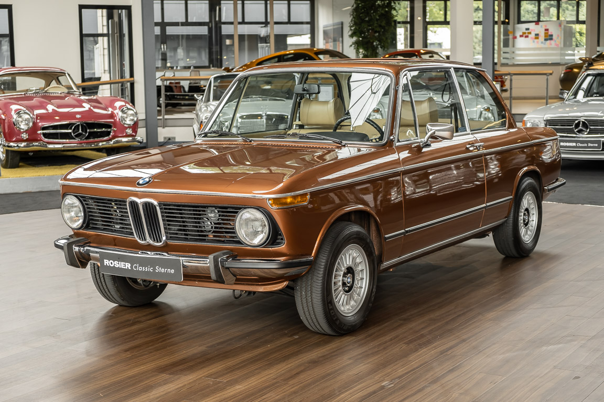

## BMW 2002: A Classic Icon

### Overview

This model from Japanese manufacturer Hasegawa, according to [ScaleMates](https://www.scalemates.com/kits/hasegawa-21123-bmw-2002-tii--1076548), was first introduced in 2017. However, it feels like the molds for the parts were created in the ’90s or even earlier. This is evident from the fact that the clear parts for the windows, as well as the interior “tub,” are made as single pieces. The quality of the internal panel lines is poor and barely visible. Additionally, the chrome moldings lack grooves for proper positioning on the body. Although the kit may not appear very detailed at first glance (without an engine or a high-quality interior), the final result looks quite realistic. If assembled and painted correctly, the outcome will be excellent.

For those seeking maximum realism and detail, resin detail sets are available from [USCP](https://uscp-ua.com/index.php?route=product/search&search=bmw%202002), nd modification videos for this kit can be found on YouTube.



### Assembly

The building process for this Hasegawa BMW 2002 Tii kit was straightforward. As mentioned earlier, the interior “bath” was a single piece, which simplified assembly but left much to be desired in terms of accuracy and realism. I assembled the model almost “out of the box” for simplicity but aimed to make it as clean as possible.

The body shell fit well with minimal sanding or adjustments needed. However, the chrome moldings required extra care due to the lack of positioning grooves, so I relied on reference images to ensure accurate placement. The suspension and undercarriage were assembled easily, with the engine already molded into the chassis. To highlight the detailing, it’s best to paint the engine, specifically its oil pan, in a separate color, and also to accent the wheel arches in a contrasting color. This results in a detailed model with eye-catching elements. Overall, while Japanese and some European model manufacturers may lack complete engine detailing, they compensate with quality parts that yield a realistic and engaging look.

### Painting

For painting, I used various types of paint (water-based acrylic, lacquer paints, and enamels).

1.	Mr. Color 100 Wine Red for the body, applied over Vallejo black primer.
2.	Seats - Vallejo Model Color: Leather Brown (70.871) and Vallejo Game Color: Elfic Flesh (72.098) for the interior.
3.	Body clear coating - 2-3 layers of Mr. Color GX 100.
4.	Tamiya X-11 (enamel) for chrome details.
5.	My favorite Vallejo acrylic metallic - Metal Color: Pale Burnt Metal (77.704) for the engine and exhaust.

All weathering effects were applied to the underside of the car, including oil stains, yellow rust, black and brown washes, all from Tamiya. Using the dry brush technique (silver metallic) over black primer highlighted the metallic parts of the car. For this, I use budget ICM Silver. Once satisfied with the result, I cover the part with semi-gloss varnish, giving a realistic look to the suspension, fuel tank, and other components of the car’s underside.

I polish the body lightly, with gentle wet sanding using fine-grit sandpaper, followed by polishing with Tamiya Polishing Compound Fine. I’m still improving my polishing and detailing skills, so I don’t spend much time on this. Occasionally, I sand through to the primer… Besides, it’s rare to see cars polished to a mirror finish on the streets. In my opinion, it doesn’t make sense to weather the underside and polish the body to a shine… Either make it perfect or make it “realistic.”

### Historical Background

The BMW 2002 is a key model that helped establish BMW’s reputation for producing sporty, driver-focused cars. It came about when BMW's product planner Helmut Werner Bönsch and M10 engine designer Alex von Falkenhausen both modified their 1600-2 cars with 2.0-liter engines. When they realized this, they submitted a proposal to the board, which aligned with American importer Max Hoffman's request for a sportier model for the U.S. market, leading to the creation of the BMW 2002.

The 2002 came in several versions, including the base model with 100 PS and the more powerful 2002 ti, which produced 120 PS. In 1971, the ti was replaced by the fuel-injected 2002 tii, which boasted 130 PS and a top speed of 185 km/h. Convertible and Touring versions were also available, offering flexibility for different drivers.

The 2002 Turbo, launched in 1973, was Europe’s first turbocharged production car, generating 170 PS and a top speed of 211 km/h. Despite being launched during the oil crisis, it became a legend for its performance and distinctive design, featuring flared arches and motorsport stripes, with only 1,672 units produced.

### Conclusion

The Hasegawa BMW 2002 Tii model is a well-designed kit that offers a satisfying assembly experience and excellent results, despite its dated design. Although it consists of relatively few parts and has some drawbacks, it can be built into a classy, realistic model. Overall, this is a great kit that rewards patience and creativity, with a straightforward assembly and minimal fit issues, making it an excellent choice for beginners and experienced modelers alike.


  
  
  
  
  
