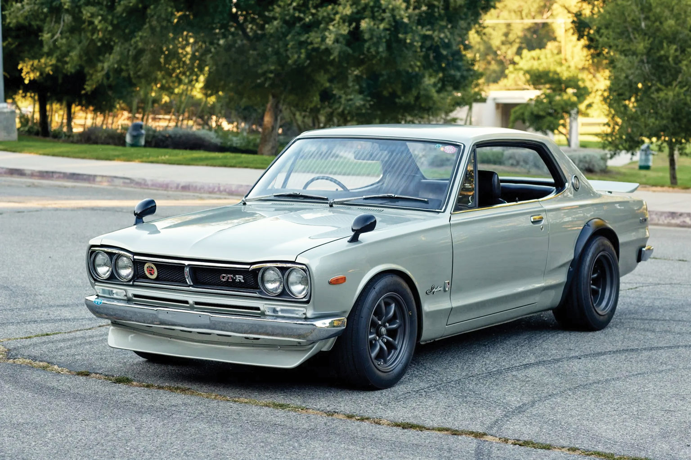

## Nissan 2000 GT-R: A Timeless Legend

### Overview

The Nissan 2000 GT-R model is highly popular among Japanese manufacturers. This Street-Custom Edition kit by Tamiya was released in 2014 but was originally introduced by the company back in 1997. This iconic car is available in various versions, including a 5-door sedan, racing, and custom versions, also offered by other brands. According to [ScaleMates](https://www.scalemates.com/uk/kits/tamiya-24194-nissan-skyline-2000-gt-r-hard-top--129389/timeline), models of this Nissan have been produced since 1979 (a decade after the real car’s debut). Tamiya’s Street-Custom Edition version includes Watanabe wheels, an additional driver figure with accessories, and photo-etched details. All parts are crisply molded and highly detailed, reflecting Tamiya’s high-quality standards. The kit features a highly detailed engine and an opening hood.



### Assembly

The assembly process was enjoyable: all parts fit perfectly, are of high quality, and the lines are sharply printed. The instructions are also clear and leave no questions. The kit includes optional engine parts (racing and standard), as well as a photo-etched radiator that can be mounted under the bumper. I initially installed it, but it looked a bit out of place as it extended too far beneath the bumper, so I removed it after assembly. Following the instructions and assembling the model carefully yields an impressive result.

There was a minor issue with the hood during the build: the instructions suggested securing it with masking tape during assembly, but I likely missed a preliminary fitting step, so after painting, the hood doesn’t fully close. This can be fixed and repainted, but for now, I’m leaving it as is. The kit also includes metal stickers for added realism. The front and rear badges can be installed as decals or with photo-etched options—I chose the photo-etched ones. The metal license plate frame (a plastic one is also included) looks very striking with the clear decal for the number.

### Painting

When I bought this kit, I wasn’t particularly enthusiastic about building it—honestly, I got it mainly because it was a great deal. So, I didn’t plan to go deep into details during painting. For the main color of this model, I chose Vallejo Metal Color: Pale Burnt Metal (77.704), which I used for the body, engine, and parts of the exhaust system. To achieve a different metallic look on various parts, I used different primers: Vallejo gray for the body and black for the engine and exhaust, also applying varying numbers of layers. This resulted in a pleasant gray metallic on the body, which I cover with 2–3 layers of Mr. Color GX100 clear coat. The window frames and chrome parts were painted with a Tamiya X-11 marker. Suspension parts were  “dry brushed” using ICM Silver. The interior was done in a two-tone scheme—black and brown Vallejo acrylic. For weathering, I applied Tamiya black wash and their powder to create effects of oil stains and traces of rust.

### Historical Background

The Nissan Skyline 2000 GT-R, also known as “Hakosuka” (a blend of “hako” meaning “box” and “suka” from “Skyline”), was introduced in 1969 as a high-performance sports car targeted at the Japanese racing market. Equipped with a 2.0-liter S20 inline-six engine producing 160 horsepower, it quickly achieved over 50 wins in Japanese racing within its first three years.

The boxy, aggressive design gave it a unique look, which became iconic in Japanese car culture. Only 1,945 units of GT-R sedans and coupes were produced, making it rare and highly valuable among collectors. Its style influenced car enthusiasts and modders, who still admire the “Hakosuka” design.

This model was the first to carry the “GT-R” badge, paving the way for future racing models from Nissan. Although production ended in 1972, the GT-R name was revived in 1989 with the release of the Skyline R32, establishing the GT-R legacy as a symbol of Japanese engineering and performance.

### Conclusion

I somewhat underestimated this kit from Tamiya. It’s very well-made, high-quality, and detailed. The contents of this kit are among the most complete, even including an additional figure 🤾‍♂️. I should have spent more time on it and done a higher-quality job. I recommend it, though perhaps not as a first kit (I’m sure it can turn out great on the first try, but the quality may not be fully appreciated). Careful work with photo-etching and thorough painting of all parts will yield an excellent and realistic model. I highly recommend it and may even assemble another variation of this beautiful car.