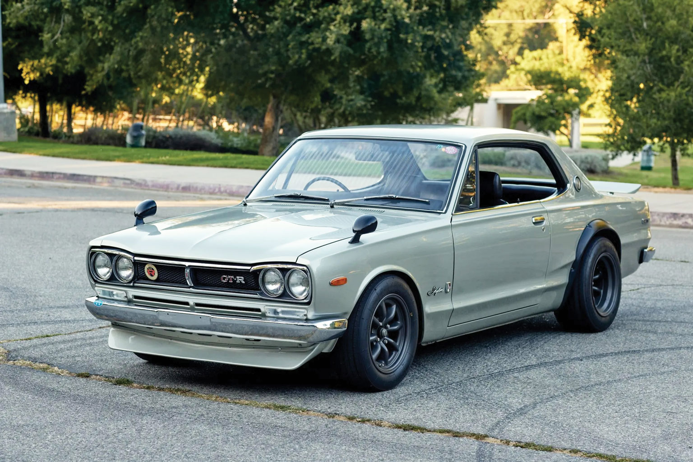

## Nissan 2000 GT-R: A Timeless Legend

### Огляд

Модель автомобіля Nissan 2000 GT-R дуже популярна серед японських виробників. Цей набір Street-Custom Edition від Tamiya був випущений у 2014 році, але вперше представлений компанією ще у 1997 році. Цей культовий автомобіль випускається в різних варіаціях, у тому числі як 5-дверний седан, гоночна та кастомна версії, також представлені іншими брендами. За даними [ScaleMates](https://www.scalemates.com/uk/kits/tamiya-24194-nissan-skyline-2000-gt-r-hard-top--129389/timeline), моделі цього Nissan випускаються з 1979 року (через 10 років після виходу реального авто). Версія від Tamiya — Street-Custom Edition — містить диски Watanabe, додаткову фігурку водія з аксесуарами та фототравлені деталі. Усі деталі чітко відлиті й гарно деталізовані, що відповідає високій якості продукції Tamiya. У наборі є високо деталізований двигуна та капот, що відкривається.



### Збірка

Процес складання був приємним: усі деталі відмінно підігнані, мають високу якість, а лінії чітко продруковані. Інструкція також зрозуміла і не викликає запитань. У наборі є опціональні деталі для двигуна (гоночні та стандартні), а також фототравлений радіатор, який можна встановити під бампером. Спочатку я його встановив, але він виглядав не зовсім доречно, оскільки сильно виступав під бампером, тому я його видалив вже після монтажу. Дотримуючись інструкції та збираючи модель акуратно, можна отримати чудовий результат.

Під час роботи виникла невелика проблема з капотом: інструкція рекомендувала закріпити його малярною стрічкою під час збирання, але, імовірно, я пропустив попередню примірку, тож після фарбування капот не закривається повністю. Це можна виправити та перефарбувати, але поки що я залишаю, як є. Комплект також містить металостікери для додаткового реалізму. Передні та задні шильдики можна встановити як декалі або використати фототравлення — я обрав фототравлення. Металева рамка для номерного знака (у комплекті є також пластикова) виглядає дуже ефектно з прозорими декалями для номера.

### Фарбування

Коли я купував цей набір, особливого ентузіазму збирати його не було — чесно кажучи, придбав його через вигідну ціну. Тому під час фарбування не хотів сильно заглиблюватися в деталі. Основним кольором для цієї моделі обрав Vallejo Metal Color: Pale Burnt Metal (77.704), яким пофарбував кузов, двигун і частини вихлопної системи. Щоб металік виглядав інакше на різних частинах, використовував різний грунт: сірий Vallejo для кузова та чорний для двигуна і вихлопної системи, а також наносив різну кількість шарів. У результаті вдалося отримати приємний сірий металік на кузові, який я покрив 2-3 шарами лаку Mr. Color GX100. Рамки вікон і хромовані деталі були пофарбовані маркером Tamiya X-11. Деталі підвіски обробив технікою “сухий пензель” із використанням ICM Silver. Салон виконаний у двоколірній гамі — чорний і коричневий акрил Vallejo. В якості везерінгу, я застосував чорну змивку Tamiya та їхню пудру для створення ефекту масляних забруднень і слідів іржі.

### Історична довідка

Nissan Skyline 2000 GT-R, або “Хакосука” (поєднання “хако” — “коробка” і “сука” від “Skyline”), був представлений у 1969 році як високопродуктивний спортивний автомобіль, орієнтований на японський гоночний ринок. Оснащений 2.0-літровим шестициліндровим двигуном S20 потужністю 160 кінських сил, він швидко завоював понад 50 перемог у японських автоперегонах за перші три роки.

Коробкоподібний, агресивний дизайн моделі надав їй особливий вигляд, який став культовим у японській автомобільній культурі. Було вироблено лише 1,945 одиниць седанів і купе GT-R, що робить його рідкісним та цінним серед колекціонерів. Його стиль вплинув на автоентузіастів та моддерів, які й досі захоплюються дизайном “Хакосука”.

Ця модель стала першою з відзнакою “GT-R”, прокладаючи шлях для майбутніх гоночних моделей Nissan. Хоча виробництво було припинено у 1972 році, назву GT-R відновили у 1989 році з випуском Skyline R32, що закріпило спадщину GT-R як символ японської інженерної та продуктивної майстерності.

### Висновки

Я трохи недооцінив цей набір від Tamiya. Він чудово виконаний, якісний і детально пророблений. Комплектація цього набору одна з найповніших, навіть із додатковою фігуркою 🤾‍♂️. Варто було витратити більше часу й зробити якісніше. Раджу його, але, можливо, не як перший набір (впевнений, що вийде і з першого разу, просто не оцінете якість). Потрібно обережно працювати з фототравленням і ретельно фарбувати всі деталі, тоді результат буде відмінним та реалістичним. Дуже рекомендую, можливо, зберу іншу варіацію цього прекрасного авто.